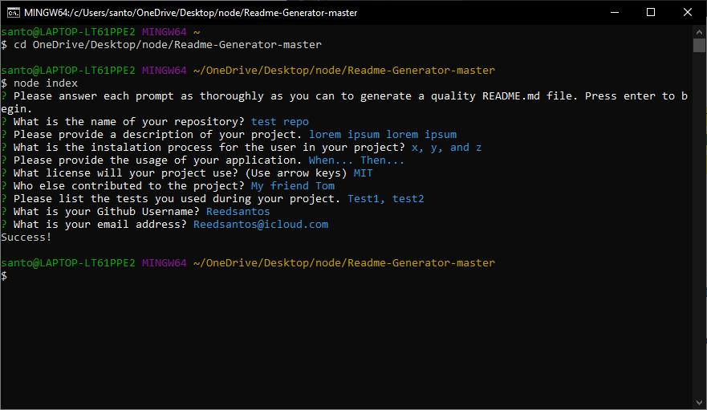

# Readme-Generator 

[Demo Link](https://drive.google.com/file/d/1V-f6ESha7IO-NiOjvgH5r8zri7gSkyhO/preview)

## Description
This application uses node.js to prompt the user for information about their project like description, installation, etc to create a quality readme. In this way, the user does not need to know markdown syntax as this application formats it with working links for the user.
### Table of Contents
-  [Title](#title)

-  [Description](#description)

-  [Installation](#installation)

-  [Usage](#usage)

-  [License](#license)

-  [Contributing](#contributing)

-  [Questions](#questions)
            
## Installation
1. Clone repository
2. Run `npm init`
3. Run `npm install inquirer`
4. Run `node index`
        
## Usage
When the user runs `node index` then they are presented with a series of prompts. 
 
When the user answers each prompt then a quality readme file is generated with the correct information and working links.

## License

## Contributing
No contributors yet but feel free to make a pull request.

## Questions
If anyone has any questions about my application please contact me below.

reedsantos@icloud.com

[Github link](https://github.com/Reedsantos)
